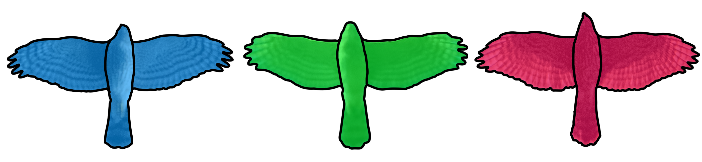
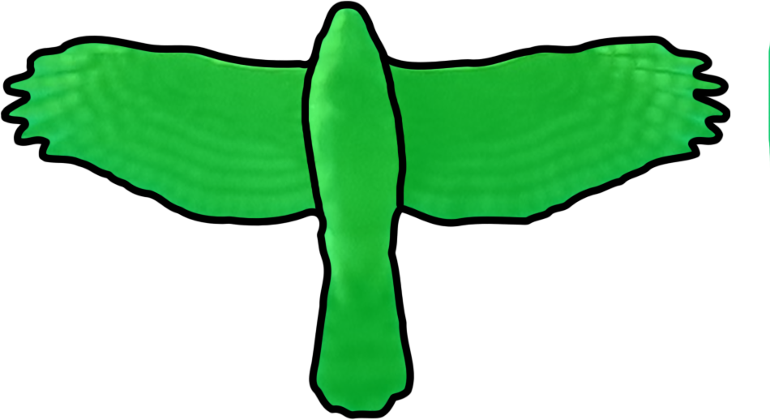

This is currently a work in progress!

Identifying raptors in flight is one of birding's great challenges.

There are fifteen species that are expected to be seen in southern Ontario (this guide can apply to most of Eastern North America). They will be broken down into these five groups:

* [**Accipitrines**](#accipitrines) (formerly Accipiter genus)
    * Sharp-shinned Hawk
    * Cooper's Hawk
    * American Goshawk
* [**Buteos**](#buteos)
    * Broad-winged Hawk
    * Red-shouldered Hawk
    * Red-tailed Hawk
    * Rough-legged Hawk
* [**Eagles**](#eagles)
    * Bald Eagle
    * Golden Eagle    
* [**Falcons**](#falcons)
    * American Kestrel
    * Merlin
    * Peregrine Falcon
* [**Others**](#others)
	* Turkey Vulture
	* Osprey
	* Northern Harrier

## Accipitrines
Longer tails and proportionate wings are key features of Accipitrines.

# Sharp-shinned Hawk

# Cooper's Hawk

# American Goshawk

## Buteos

# Broad-winged Hawk
# Red-shouldered Hawk
# Red-tailed Hawk
# Rough-legged Hawk

## Eagles
# Bald Eagle
# Golden Eagle

## Falcons
# American Kestrel
# Merlin
# Peregrine Falcon

## Others
# Turkey Vulture
# Osprey
# Northern Harrier